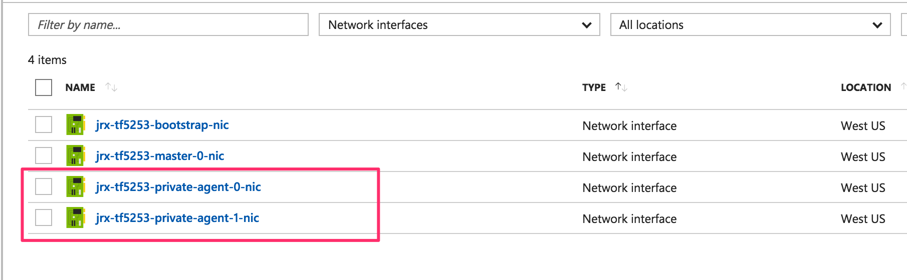
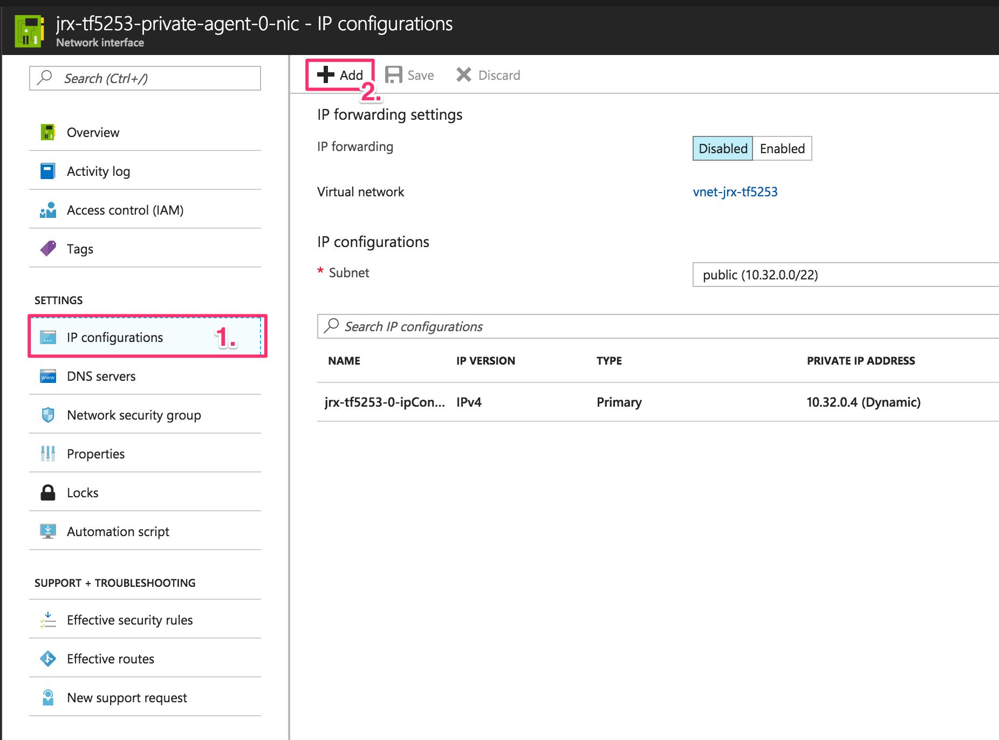
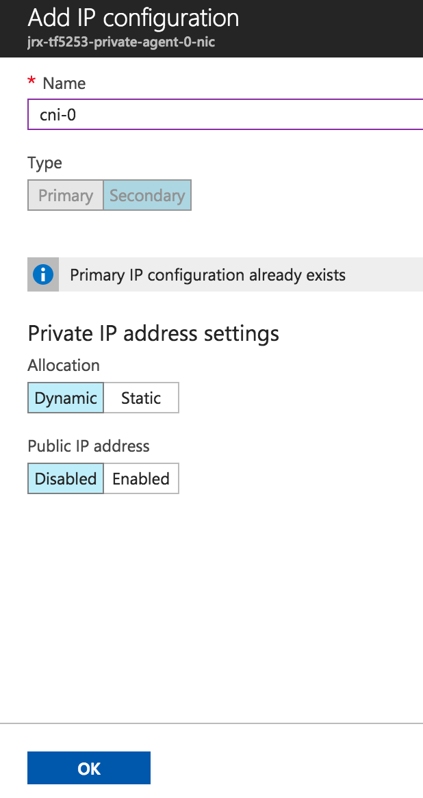

# azure-cni

## Overview

DC/OS 1.10 adds support for CNI plugins and Data Services (based on the DC/OS SDK) are able to use this CNI-Based virtual networks: https://docs.mesosphere.com/1.10/networking/virtual-networks/cni-plugins/)

If you running DC/OS on Azure, you can try out the integration with Azure CNI. For this guide I adapted the example the Azure CNI documentation: https://github.com/Azure/azure-container-networking/blob/master/docs/cni.md

## Installation of Azure CNI

You can find the latest release bundles for Azure CNI here: https://github.com/Azure/azure-container-networking/releases

**The following steps need to be done on each DC/OS Agent and Public Agent:**

Download the release bundle to a local directory:

```
mkdir /tmp/azure-cni && cd /tmp/azure-cni
curl -LO https://github.com/Azure/azure-container-networking/releases/download/v0.91/azure-vnet-cni-linux-amd64-v0.91.tgz
```

Unpack the package and move the files to the following directories:

```
sudo tar xvf azure-vnet-cni-linux-amd64-v0.91.tgz
sudo mv azure-vnet /opt/mesosphere/active/cni/
sudo mv azure-vnet-ipam /opt/mesosphere/active/cni/
```

Configure Azure CNI module:

```
vi /opt/mesosphere/etc/dcos/network/cni/azure-vnet.cni
```

Specify the network interface you want use for obtaining additional IP address, e.g. `eth0`:

```
{
  "cniVersion": "0.2.0",
  "name": "azure",
  "type": "azure-vnet",
  "master": "eth0",
  "bridge": "azure0",
  "logLevel": "info",
  "ipam": {
    "type": "azure-vnet-ipam",
    "environment": "azure"
  }
}
```

Restart the Agent:

```
systemctl restart dcos-mesos-slave
```

or

```
systemctl restart dcos-mesos-slave-public
```

You can find the logs created by the Azure CNI Plugin here:

- /var/log/azure-vnet.log
- /var/log/azure-vnet-ipam.log

## Add IP addresses to Azure VM

In order for the Azure CNI to be able to allocate IP addresses you need to add more than one IP address to the interface of the Agent VMs. The documentation for that is: https://docs.microsoft.com/en-us/azure/virtual-network/virtual-network-network-interface-addresses

You can also use the Azure Portal to add more IP addresses:

- Find the Network Interface for one of your private agents and open it:



- Find the IP configurations tabs, open it and click on "Add":



- Add a new dynamic IP address to the interface:



## Example Config

If everything is configured correctly, you shoud be able to start an example nginx server configured with an IP address allocated via Azure CNI:

```
{
  "id": "/nginx-ucr-azure",
  "instances": 1,
  "container": {
    "type": "MESOS",
    "volumes": [],
    "docker": {
      "image": "nginx:alpine"
    },
    "portMappings": []
  },
  "cpus": 0.1,
  "mem": 128,
  "requirePorts": false,
  "networks": [
    {
      "name": "azure",
      "mode": "container"
    }
  ],
  "healthChecks": [],
  "fetch": [],
  "constraints": []
}
```

```
dcos task exec nginx-ucr-azure ping -c 3 nginx-ucr-azure.marathon.containerip.dcos.thisdcos.directory
```
